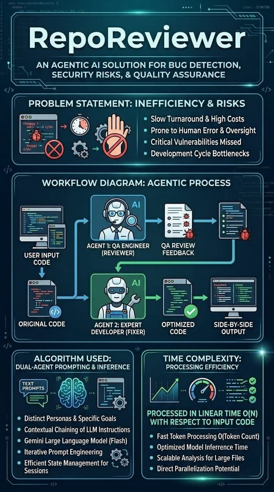

# 🔍 Repo Reviewer

**[🚀 Try the Live App Here!](https://reporeviewer.streamlit.app)**



**Repo Reviewer** is an AI-powered code analysis and repair pipeline. It leverages a dual-agent architecture powered by Google's `gemini-2.5-flash-lite` model to automatically detect bugs, identify security vulnerabilities, and generate clean, corrected code.

## ✨ Features

* **🤖 Dual-Agent Collaboration:** A seamless handoff between a virtual QA Engineer and an Expert Developer.
* **🐞 Automated Bug Detection:** Identifies unhandled exceptions, potential security flaws, and missing input validations.
* **🛠️ Automated Corrections:** Generates refactored, production-ready code blocks without unnecessary fluff.
* **⚡ Fast Feedback Loop:** Utilizes the lightweight `flash-lite` model for rapid, concise responses.

## 🏗️ How It Works

The pipeline operates in two distinct stages:

1.  **Stage 1: Senior QA Engineer (Agent 1)**
    * Analyzes the pasted source code.
    * Outputs a strict, concise, bulleted list of bugs, anti-patterns, and security risks.
2.  **Stage 2: Expert Developer (Agent 2)**
    * Takes both the *original code* and the *QA feedback*.
    * Applies the necessary fixes.
    * Outputs the corrected code block along with a focused, 1-sentence summary of the changes.

## 🚀 Getting Started

### Prerequisites

* Python 3.8 or higher
* A Google Gemini API Key

### Installation to run locally

1.  **Clone the repository:**
    ```bash
    git clone [https://github.com/yourusername/RepoReviewer.git](https://github.com/yourusername/RepoReviewer.git)
    cd RepoReviewer
    ```

2.  **Install the required dependencies:**
    ```bash
    pip install -r requirements.txt
    ```

3.  **Set up your environment variables:**
    Create a `.env` file in the root directory and add your Google API key:
    ```env
    GOOGLE_API_KEY="your_api_key_here"
    ```

## 💻 Usage

1. Run the script from your terminal:
   ```bash
   streamlit run app.py
